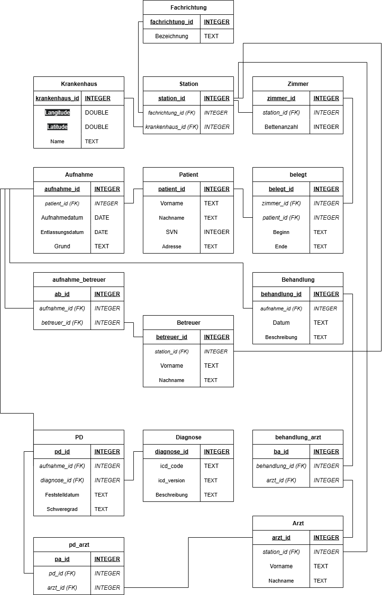
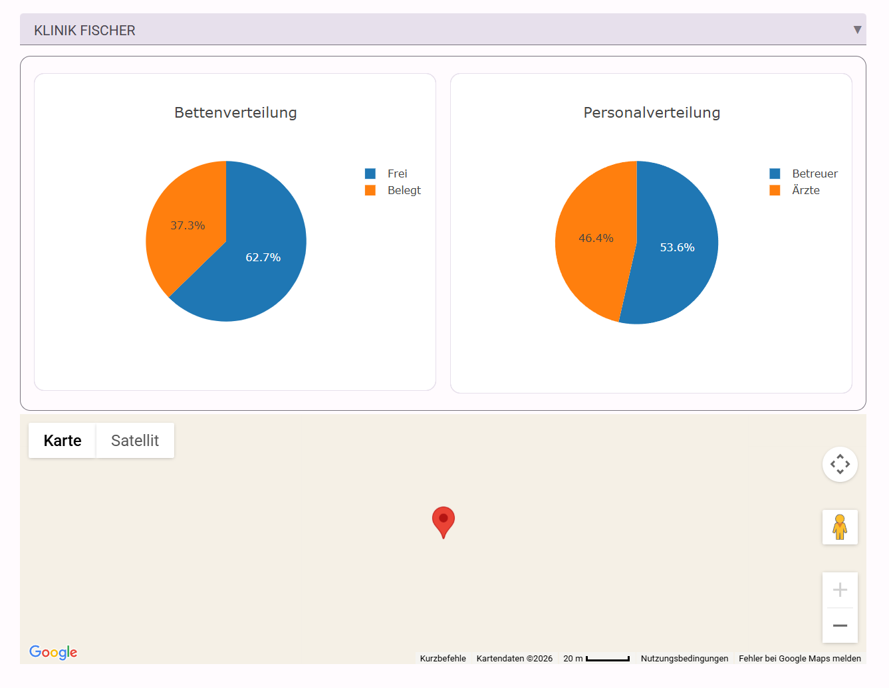
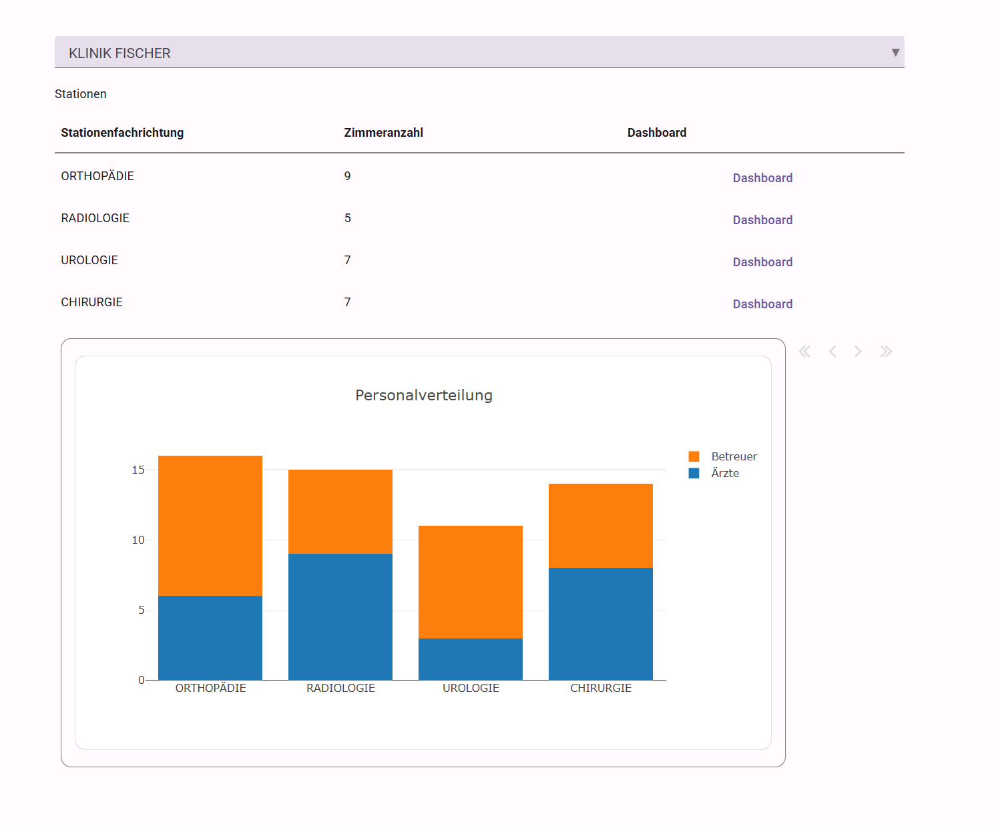
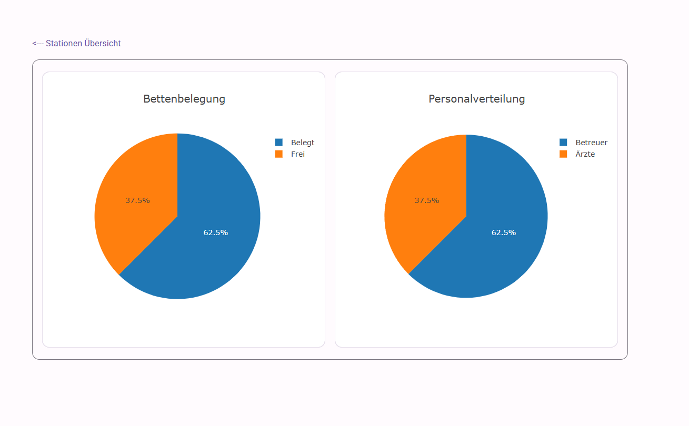
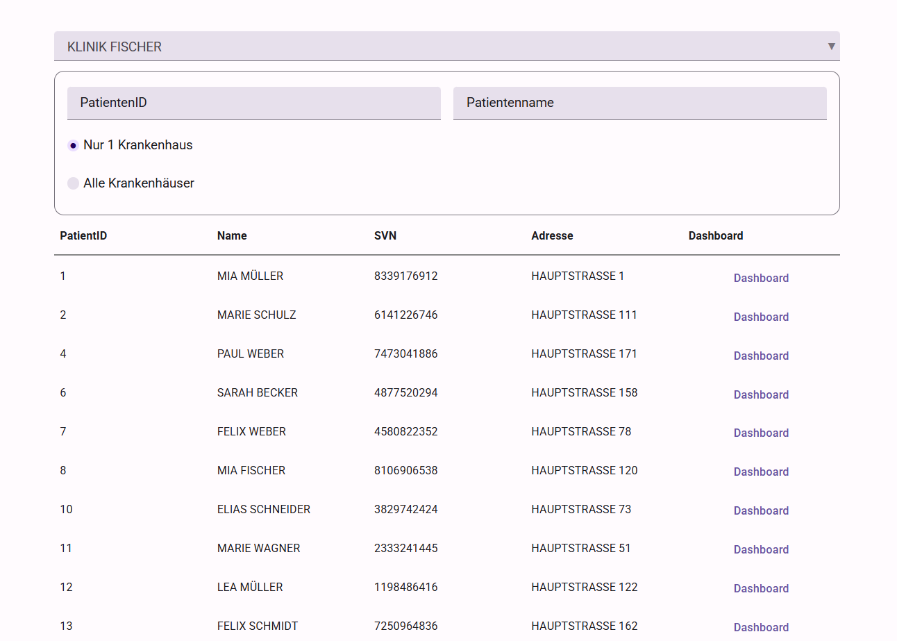
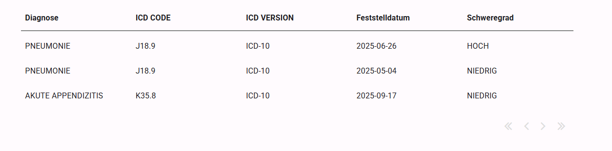

# Projektbeschreibung Krankenhausprojekt

## Publish Link

https://pir4t3141-krankenhaus-system.anvil.app

## ERM

## RM

## Doku

### Krankenhaus

- Drop-Down: Universell für alle Forms die man links sieht
- Graphen für allgemeine Infos fürs Krankenhaus.
    - Rechter Graph kann man anklicken um genaueres über Ärzte/Betreuer zu erfahren
- Google-Maps wo das Krankenhaus ist (Zufällige Koordinaten)

### Stationen

- Zeigt alle Stationen des Krankenhaus an
- Personalverteilung der Stationen

#### Dashboard

- Bettenbelegung (Wie viel freie Betten in der Station)
- Personalverteilung in der Station 
    - Anclickbar für genauere Infos über Ärzte/Betreuer

### Patienten

- Zeigt alle Patienten die den Filtern entsprechen an
- Filter:
    - PatientenID
        - Zeigt nur Patienten an, bei denen der Inhalt der Textbox in der ID ist (z.B. Textbox: 1, PatientenIDs: 1, 12, 15, 101, ...)
    - Patientenname
        - Zeigt nur Patienten an, bei denen der Inhalt der Textbox in dem Patientennamen ist (z.B. Textbox: Al, Patientennamen: Alexei, Aleksandra, Alexander, ...)
    - RadioButtons
        - Ob nur bei einem Krankenhaus oder bei allen gesucht wird

#### Dashboard

- Zeigt alle Diagnosen des Patienten an, geordnet nach Schweregrad
